# LILERP - Liberia Integrated Land Registry & Emergency Response Platform

## Project Description

**LILERP (Liberia Integrated Land Registry & Emergency Response Platform)** is a comprehensive voice-based emergency response system designed specifically for land disputes in rural Liberia (Nimba County). The system prioritizes accessibility for illiterate users through an Interactive Voice Response (IVR) interface while providing modern web and mobile applications for tech-savvy users.

### Key Innovation

- **Voice-first design** accessible to illiterate users
- **Multi-platform approach** (IVR, web, mobile)
- **Cultural integration** with traditional governance structures
- **Emergency response** specifically for land disputes

## Live Deployment

**Production URLs:**

- **Mobile Application**: https://lilerp-system.vercel.app
- **Public Website**: https://lilerp-web.vercel.app
- **Backend API**: https://lilerp-backend.onrender.com

**Test Credentials:**

- Create your own account via registration
- Or use: `admin@lilerp.org` / `admin123` (Responder access)

**☎️ IVR Hotline**: `+1 (762) 248-5141`

---

## Testing

### Frontend Tests (lilerp-mobile)

**Test Framework:** Vitest + React Testing Library

**Test Results:**

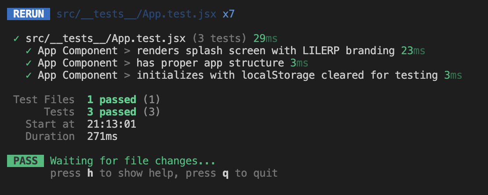

**Test Coverage:**

- ✅ App Component - Splash screen rendering
- ✅ App Component - Proper app structure validation
- ✅ App Component - LocalStorage initialization
- **All 3 tests passing (100%)**

**Run tests locally:**

```bash
cd lilerp-mobile
npm test
```

## GitHub Repository

**Repository URL:** https://github.com/Williedaniels/lilerp-system

## Figma UI Design

**Figma URL:** https://www.figma.com/design/OrcpTusKt1kE9CWk2HTWvH/Untitled?node-id=0-1&t=r9zedkD2in6Tm2vM-1

---

## Quick Start Guide

### 🚀 Get Started in 3 Steps

#### Step 1: Install Fixes (1 minute)

```bash
cd lilerp-system
chmod +x INSTALL_FIXES.sh
./INSTALL_FIXES.sh
```

This will:

- ✅ Backup your current files
- ✅ Install all improvements
- ✅ Install dependencies

#### Step 2: Start Backend (Required)

```bash
cd backend
npm install
node server.js
```

Backend runs on: **<http://localhost:3001>**

#### Step 3: Start Mobile App

```bash
cd lilerp-mobile
npm install --legacy-peer-deps
npm run dev
```

Mobile app runs on: **<http://localhost:5173>**

#### Step 4: Start LILERP Website

```bash
cd frontend/lilerp-website
npm install --legacy-peer-deps
npm run dev
```

---

## Or Setup the Environment and Project Installation the old-fashion way

### Prerequisites

- **Node.js** 18+ and npm/pnpm
- **PostgreSQL** 12+
- **Git**

### Backend Setup

1. **Install and Configure PostgreSQL**

   ```bash
   # Ubuntu/Debian
   sudo apt-get update
   sudo apt-get install postgresql postgresql-contrib
   
   # macOS
   brew install postgresql
   brew services start postgresql
   
   # Windows
   # Download and install from https://www.postgresql.org/download/windows/
   ```

2. **Create Database**

   ```bash
   # Navigate to project directory
   cd lilerp-system/backend
   
   # Run database setup script
   bash database/setup.sh
   ```

3. **Install Dependencies and Start Server**

   ```bash
   npm install
   npm start  # Starts on port 3001
   ```

### Frontend Website Setup

```bash
cd frontend/lilerp-website
pnpm install
pnpm run dev  # Starts on port 5173
```

### Mobile App Setup

```bash
cd lilerp-mobile
pnpm install
pnpm run dev  # Starts on port 5174
```

### Environment Variables

Create `.env` file in the backend directory:

```env
NODE_ENV=development
PORT=3001
DB_HOST=localhost
DB_PORT=5432
DB_NAME=lilerp_db
DB_USER=postgres
DB_PASSWORD=password
JWT_SECRET=your-secret-key
TWILIO_ACCOUNT_SID=your-twilio-sid
TWILIO_AUTH_TOKEN=your-twilio-token
```

## Design Documentation

### User Interface Design Process

#### 1. Design Considerations

- **Accessibility First**: Designed for users with limited literacy and technology experience
- **Cultural Sensitivity**: Respects traditional governance structures and communication patterns
- **Multi-Modal Access**: Voice, web, and mobile interfaces for different user capabilities
- **Rural Constraints**: Optimized for low-bandwidth and intermittent connectivity

#### 2. Wireframes and Mockups

**Voice Interface Flow:**

```txt
Incoming Call → Welcome Message → Main Menu
├── Press 1: Report Land Dispute
│   ├── Record Location
│   ├── Record Incident Type  
│   ├── Record Description
│   └── Confirmation & Incident ID
└── Press 2: Exit
```

**Web Interface Sections:**

- Hero section with system overview
- Features showcase with icons and descriptions
- Statistics dashboard showing impact metrics
- Contact form for partnerships
- Mobile app download section

**Mobile App Screens:**

- Emergency reporting form
- Voice recording interface
- GPS location picker
- Report tracking dashboard
- Direct calling to emergency services

#### 3. Style Guide

**Color Palette:**

- Primary: `#1e40af` (Blue - Trust, reliability)
- Secondary: `#059669` (Green - Safety, growth)
- Accent: `#dc2626` (Red - Emergency, urgency)
- Neutral: `#374151` (Gray - Text, backgrounds)

**Typography:**

- Headers: Inter, sans-serif
- Body: Inter, sans-serif
- Monospace: JetBrains Mono

**Design Principles:**

- High contrast for accessibility
- Large touch targets (minimum 44px)
- Clear visual hierarchy
- Consistent spacing and alignment

## Deployment Plan

### Development Environment

- **Local Development**: Node.js servers with hot reload
- **Database**: PostgreSQL running locally
- **Testing**: Manual testing with Postman for API endpoints

### Staging Environment

- **Platform**: Heroku or Railway for easy deployment
- **Database**: Heroku Postgres or Railway PostgreSQL
- **Domain**: Staging subdomain for testing
- **CI/CD**: GitHub Actions for automated deployment

### Production Environment

#### Backend Deployment

- **Platform**: AWS EC2 or DigitalOcean Droplet
- **Database**: AWS RDS PostgreSQL or managed PostgreSQL
- **Load Balancer**: AWS ALB or Nginx
- **SSL**: Let's Encrypt certificates
- **Monitoring**: AWS CloudWatch or DataDog

#### Frontend Deployment

- **Website**: Vercel or Netlify for static hosting
- **Mobile App**: Progressive Web App hosted on CDN
- **CDN**: CloudFlare for global content delivery
- **Analytics**: Google Analytics for usage tracking

#### IVR Integration

- **Service**: Twilio for voice and SMS capabilities
- **Webhooks**: Secure endpoints for Twilio callbacks
- **Recording Storage**: AWS S3 or similar cloud storage
- **Backup**: Multiple data center replication

### Deployment Steps

1. **Prepare Production Environment**

   ```bash
   # Set up production server
   sudo apt update && sudo apt upgrade
   sudo apt install nodejs npm postgresql nginx
   
   # Configure firewall
   sudo ufw allow 22,80,443,3001/tcp
   ```

2. **Deploy Backend**

   ```bash
   # Clone repository
   git clone https://github.com/your-username/lilerp-system
   cd lilerp-system/backend
   
   # Install dependencies
   npm install --production
   
   # Set up database
   bash database/setup.sh
   
   # Start with PM2
   npm install -g pm2
   pm2 start server.js --name lilerp-backend
   ```

3. **Deploy Frontend**

   ```bash
   # Build and deploy website
   cd ../frontend/lilerp-website
   npm run build
   # Upload dist/ to hosting service
   
   # Build and deploy mobile app
   cd ../../lilerp-mobile
   npm run build
   # Upload dist/ to hosting service
   ```

4. **Configure Domain and SSL**

   ```bash
   # Set up Nginx reverse proxy
   sudo nano /etc/nginx/sites-available/lilerp
   # Configure SSL with Let's Encrypt
   sudo certbot --nginx -d yourdomain.com
   ```

### Monitoring and Maintenance

- **Uptime Monitoring**: UptimeRobot or Pingdom
- **Error Tracking**: Sentry for application errors
- **Performance**: New Relic or DataDog APM
- **Backup Strategy**: Daily database backups to cloud storage
- **Security Updates**: Automated security patches

---

## Demo Videos

### Technical Deep Dive (5 minutes)

<div style="position: relative; padding-bottom: 56.25%; height: 0;"><iframe src="https://www.loom.com/share/17468703c9a949b295cb6a4b672f90a8?sid=128b9852-2637-43a9-ab67-16943ad57860" frameborder="0" webkitallowfullscreen mozallowfullscreen allowfullscreen style="position: absolute; top: 0; left: 0; width: 100%; height: 100%;"></iframe></div>

*Complete walkthrough of the LILERP emergency response system*

### Complete System Demonstration (4 minutes)

<div style="position: relative; padding-bottom: 56.25%; height: 0;"><iframe src="https://www.loom.com/share/6ad68038b7464a25b51a7230209e10d9?sid=eb540daa-a648-4e72-9368-587533a7c277" frameborder="0" webkitallowfullscreen mozallowfullscreen allowfullscreen style="position: absolute; top: 0; left: 0; width: 100%; height: 100%;"></iframe></div>

*Technical implementation and architecture overview*

---

## Application Screenshots

### Web Interface

#### Homepage

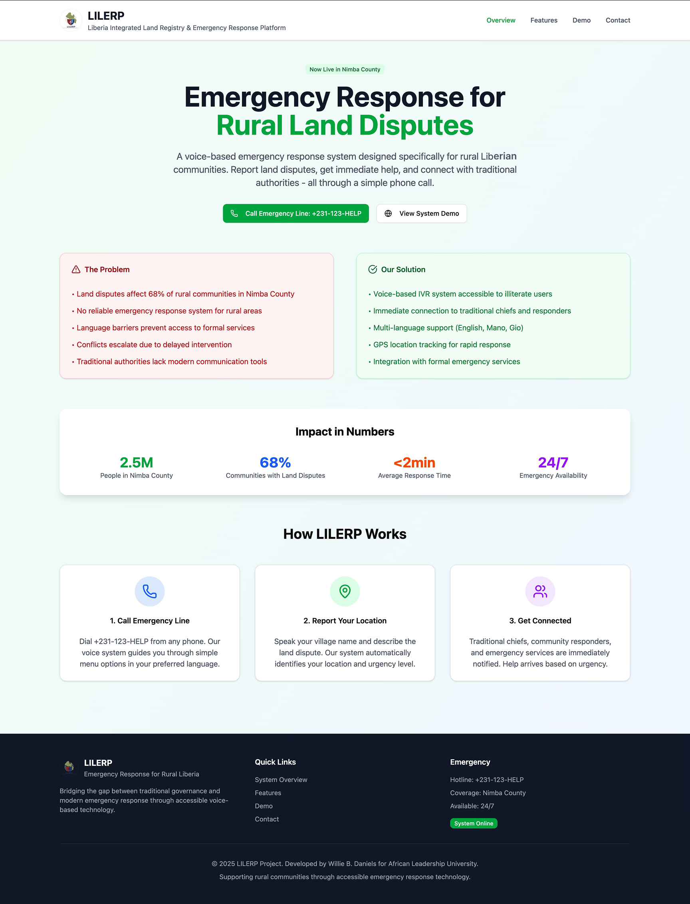
*Clean, professional landing page with clear value proposition*

#### Features Section  

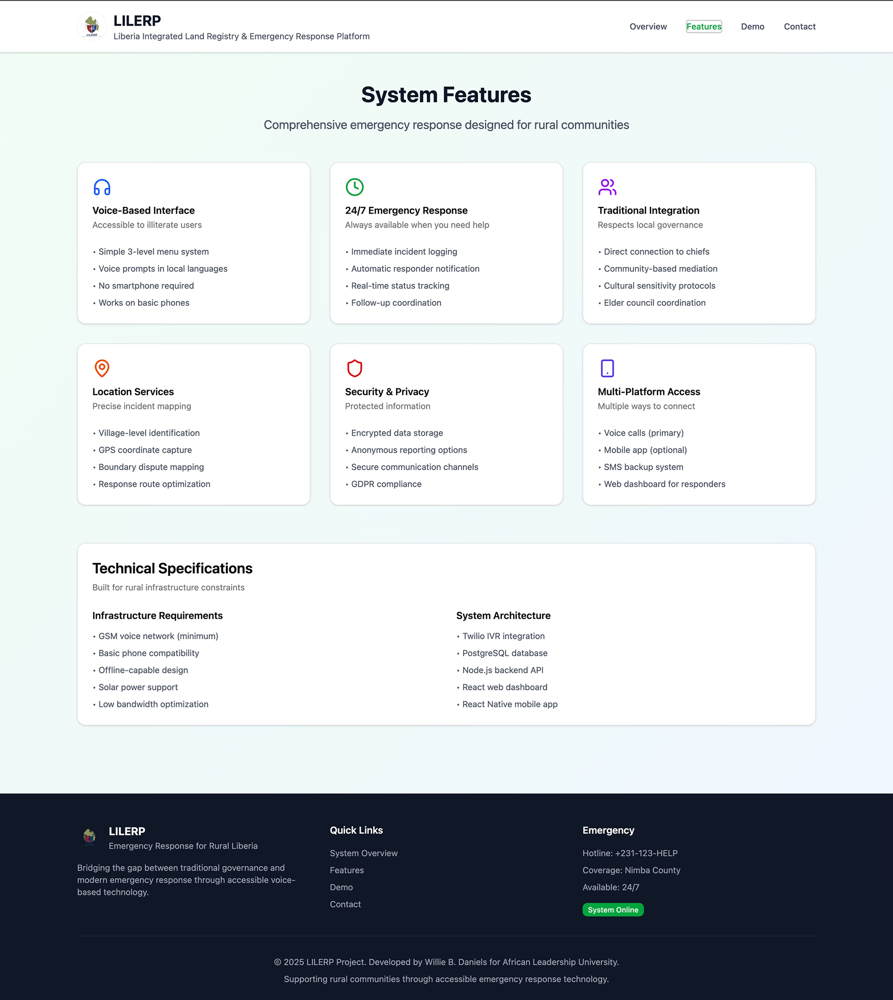
*Icons and descriptions of key capabilities*

#### Demo Page

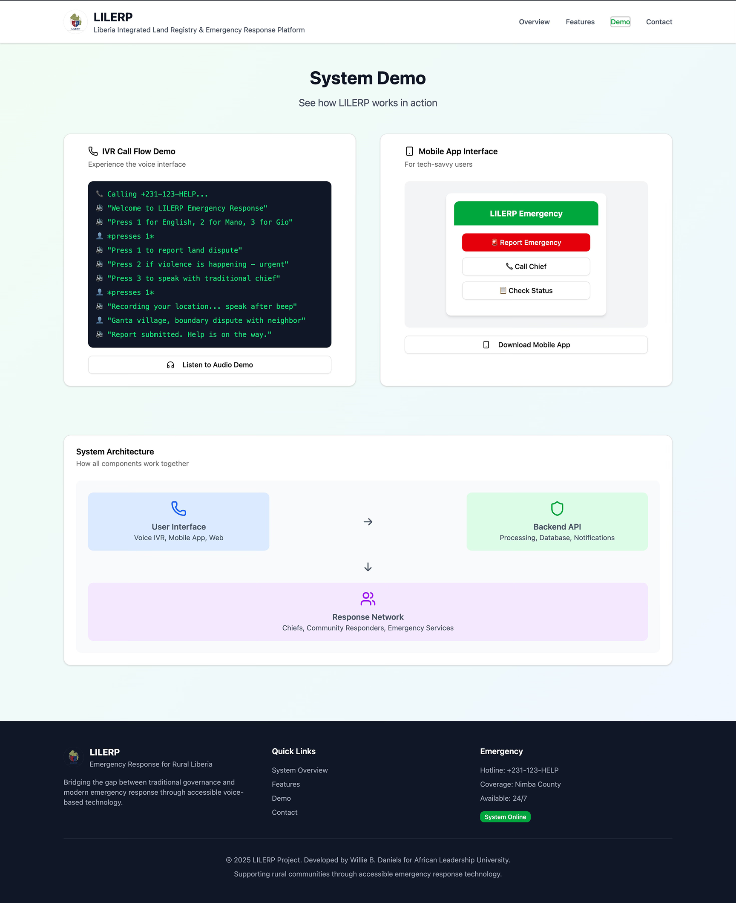
*Visual representation of system impact*

#### Contact Page

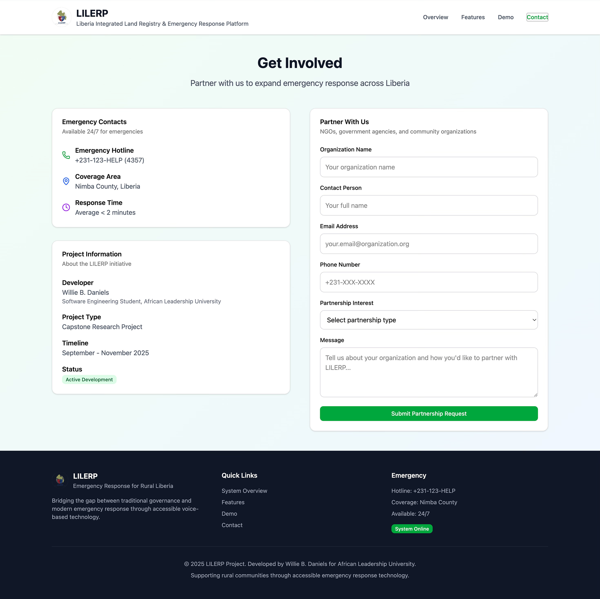
*Partnership inquiry form for NGOs and government*

### Mobile Application

#### Home Screen

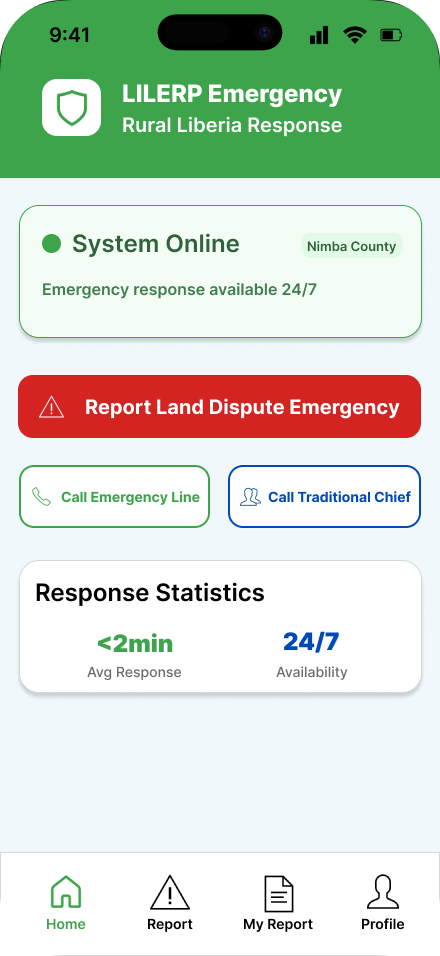

*Main dashboard showing emergency hotline number, quick report button, and recent activity feed for easy access to critical functions*

#### Report Screen

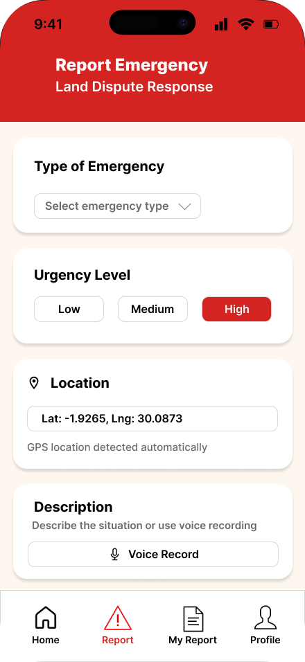

*Emergency reporting interface with voice recording capability, location detection, and incident type selection for land disputes*

#### My Report Screen

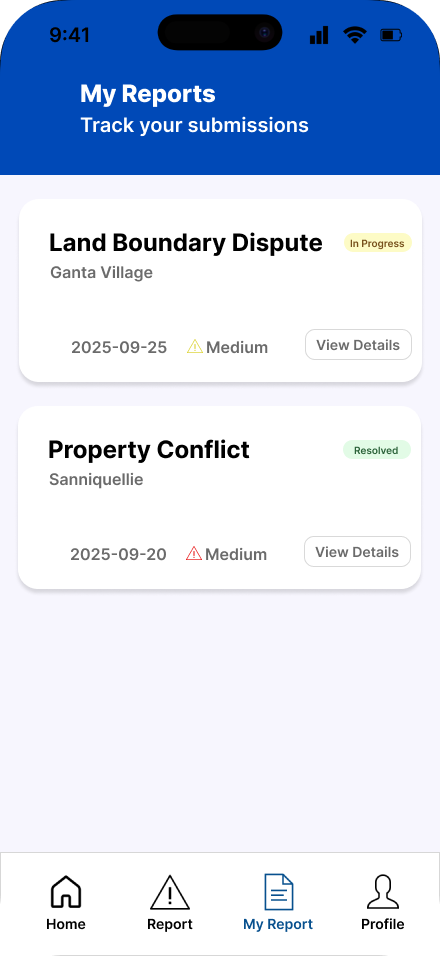

*User's personal report history showing submission status, tracking IDs, and resolution progress for transparency and follow-up*

#### Profile Screen

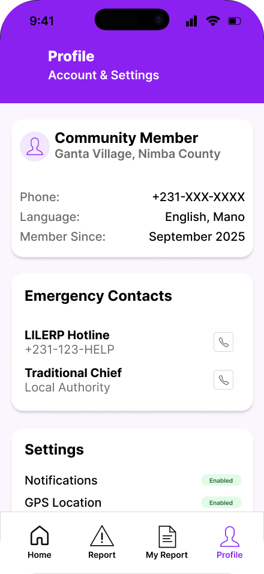

*User profile management with contact information, preferred language settings, and emergency contact configuration for personalized service*

### IVR System Flow

#### Menu Nagivation

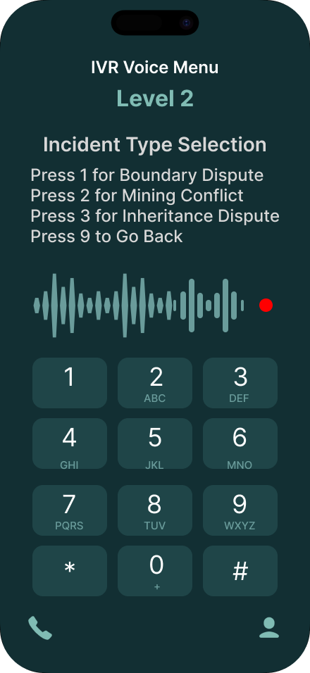

*Clear options for different emergency types*

#### Recording Interface

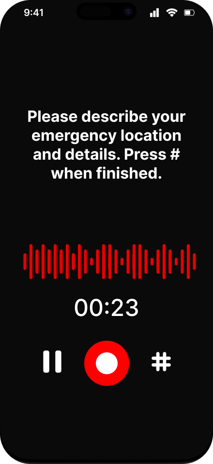

*Voice capture with visual feedback*

## Code Files Structure

```md
lilerp-system/
├── backend/
│   ├── config/
│   │   └── database.js
│   ├── database/
│   │   ├── setup.sql
│   │   └── setup.sh
│   ├── middleware/
│   │   └── auth.js
│   ├── models/
│   │   ├── User.js
│   │   ├── Incident.js
│   │   ├── Response.js
│   │   └── index.js
│   ├── routes/
│   │   ├── auth.js
│   │   ├── incidents.js
│   │   ├── ivr.js
│   │   └── responders.js
│   ├── utils/
│   │   └── notifications.js
│   ├── .env.example
│   ├── package.json
│   └── server.js
├── frontend/
│   └── lilerp-website/
│       ├── src/
│       │   ├── components/
│       │   ├── App.jsx
│       │   └── App.css
│       ├── index.html
│       ├── package.json
│       └── vite.config.js
├── lilerp-mobile/
│   ├── src/
│   │   ├── components/
│   │   ├── App.jsx
│   │   └── main.jsx
│   ├── index.html
│   ├── package.json
│   └── vite.config.js
├── README.md
├── API_DOCUMENTATION.md
├── DEPLOYMENT.md
└── DEMO_GUIDE.md
```

## Technical Specifications

### Backend Architecture

- **Framework**: Node.js with Express.js
- **Database**: PostgreSQL with Sequelize ORM
- **Authentication**: JWT-based with role-based access control
- **API Design**: RESTful endpoints with proper HTTP status codes
- **External Integration**: Twilio for IVR and SMS capabilities

### Frontend Technologies

- **Website**: React with Vite build tool
- **Styling**: TailwindCSS for responsive design
- **Mobile**: Progressive Web App with offline capabilities
- **State Management**: React hooks and context API
- **Build Process**: Optimized production builds with code splitting

### Database Schema

- **Users**: Authentication and role management
- **Incidents**: Emergency reports with location and voice recordings
- **Responses**: Responder actions and status updates
- **Relationships**: Proper foreign keys and data integrity constraints

### Security Measures

- **Data Encryption**: Passwords hashed with bcrypt
- **API Security**: JWT tokens with expiration
- **Input Validation**: Sanitized user inputs
- **Privacy Protection**: Minimal data collection and GDPR compliance

This comprehensive package demonstrates a complete full-stack application addressing real-world challenges in rural emergency response, showcasing both technical skills and social impact awareness.
