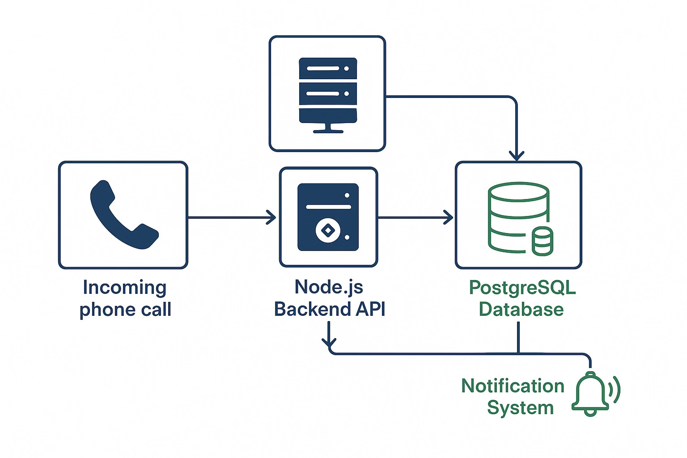
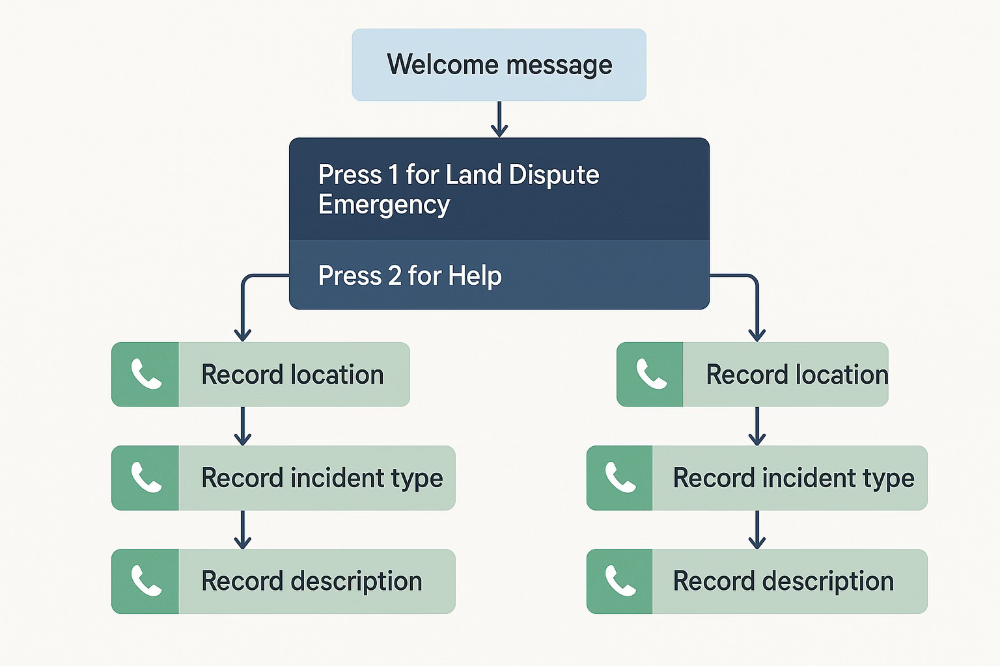
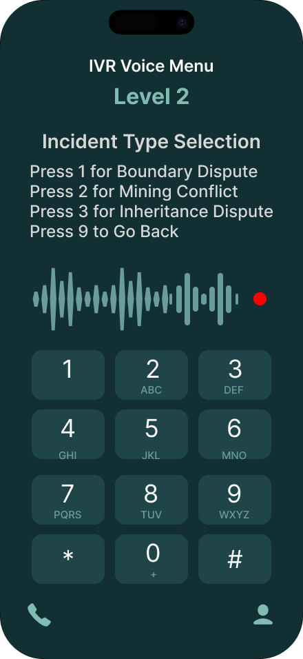
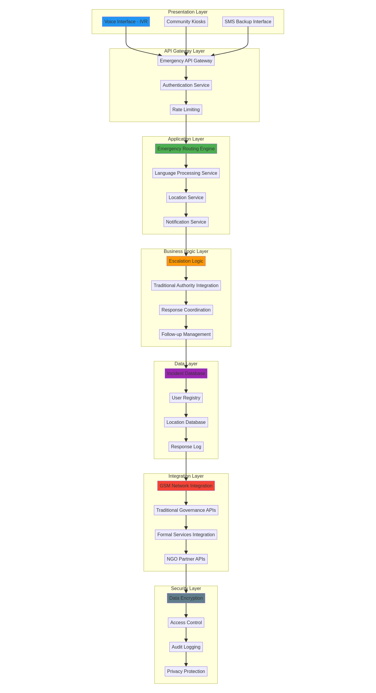

# LILERP Voice Interface Design Documentation

## Overview

This document presents the complete voice interface design for LILERP's Interactive Voice Response (IVR) system. The designs prioritize accessibility for illiterate users while maintaining cultural sensitivity and technical feasibility for rural deployment in Nimba County, Liberia.

## Design Philosophy

### Core Principles

- **Accessibility First**: Designed for users with no literacy or technology experience
- **Cultural Sensitivity**: Respects traditional communication patterns and governance structures
- **Simplicity**: Maximum 3-level menu depth to prevent user confusion
- **Reliability**: Works on basic feature phones with poor connectivity

### Visual Design Language

- **Colors**: Green (safety, growth) and Blue (trust, reliability) with high contrast
- **Typography**: Clear, large text for visual representations
- **Icons**: Universal symbols (phone, recording, keypad) for intuitive understanding
- **Layout**: Clean, uncluttered interfaces with clear hierarchy

## Voice Interface Designs

### 1. IVR Flow Diagram



**Purpose**: Complete system flow showing all user paths and decision points

**Key Features**:

- Welcome message entry point
- Clear branching for emergency reporting vs. help
- Sequential voice recording steps (location → type → description)
- Error handling and fallback options
- Integration points with traditional governance

**Technical Implementation**:

- TwiML responses for each decision point
- Voice recording capture at each step
- Database integration for incident creation
- SMS fallback for confirmation

### 2. Voice Menu Level 1 - Welcome Screen



**Purpose**: Initial user interaction with clear, simple options

**Voice Prompt**:
> "Welcome to LILERP Emergency Response for Nimba County. Press 1 to report a land dispute emergency. Press 2 for help and information."

**Key Features**:

- Large, clear keypad numbers
- Audio waveform visualization
- Phone icon for familiarity
- High contrast design for visibility
- Status indicators for call progress

**User Experience**:

- Maximum 2 options to prevent confusion
- Familiar phone interface metaphor
- Clear audio cues with visual backup
- Immediate response to keypress

### 3. Voice Menu Level 2 - Incident Type Selection



**Purpose**: Categorize the type of land dispute for appropriate response

**Voice Prompt**:
> "Please select your emergency type. Press 1 for boundary dispute, Press 2 for mining conflict, Press 3 for inheritance dispute, Press 9 to go back."

**Key Features**:

- Standard phone keypad layout
- Audio waveform showing active voice prompt
- Recording indicator for system status
- Navigation option (Press 9 to go back)
- Consistent visual design with Level 1

**Technical Details**:

- Captures DTMF tones for menu selection
- Routes to appropriate response protocols
- Logs incident type in database
- Provides escape route for user errors

### 4. Voice Recording Interface


**Purpose**: Capture detailed emergency information through voice recording

**Voice Prompt**:
> "Please describe your emergency location and details. Speak clearly and press # when finished."

**Key Features**:

- Large red recording button (universal recording symbol)
- Real-time audio waveform visualization
- Timer showing recording duration (00:23 shown)
- Emergency contact numbers for escalation
- Pause/stop controls for user control

**Technical Implementation**:

- Records to Twilio's cloud storage
- Automatic transcription where available
- Maximum recording length limits
- Audio quality optimization for rural networks

### 5. IVR System Architecture



**Purpose**: Technical overview of system components and data flow

**Components Shown**:

- **Incoming Phone Call**: Entry point for all voice interactions
- **Node.js Backend API**: Processes TwiML responses and handles business logic
- **PostgreSQL Database**: Stores incident reports and user data
- **Notification System**: Alerts responders and traditional chiefs

**Data Flow**:

1. User calls emergency number
2. Twilio routes to Node.js webhook
3. System generates TwiML response for voice prompts
4. User inputs captured and processed
5. Incident record created in database
6. Notifications sent to appropriate responders

## Technical Specifications

### Voice Menu Structure

```txt
Level 1: Welcome
├── Press 1: Report Land Dispute Emergency
│   ├── Level 2: Incident Type Selection
│   │   ├── Press 1: Boundary Dispute
│   │   ├── Press 2: Mining Conflict
│   │   ├── Press 3: Inheritance Dispute
│   │   └── Press 9: Go Back
│   ├── Level 3: Voice Recording
│   │   ├── Record Location Details
│   │   ├── Record Incident Description
│   │   └── Press # to Finish
│   └── Confirmation & Incident ID
└── Press 2: Help and Information
    ├── System Instructions
    ├── Emergency Contact Numbers
    └── Press 9: Return to Main Menu
```

### Audio Requirements

- **Voice Prompts**: Clear, slow-paced English (future: Mano, Gio languages)
- **Recording Quality**: Minimum 8kHz sampling rate for voice clarity
- **Compression**: Optimized for GSM network transmission
- **Duration Limits**: Maximum 2 minutes per recording segment

### Accessibility Features

- **High Contrast**: All visual elements meet WCAG AA standards
- **Large Touch Targets**: Minimum 44px for keypad buttons
- **Audio Feedback**: Confirmation tones for all user inputs
- **Error Recovery**: Clear instructions for correcting mistakes
- **Timeout Handling**: Reasonable delays with helpful prompts

## Implementation Guidelines

### For Figma Design Creation

1. **Setup Design System**:
   - Create color palette: Primary Blue (#1e40af), Secondary Green (#059669), Emergency Red (#dc2626)
   - Set up text styles: Headers (24px), Body (18px), Captions (14px)
   - Create component library for buttons, keypads, and status indicators

2. **Voice Flow Diagram**:
   - Use flowchart shapes with rounded corners
   - Connect with clear arrows showing user paths
   - Add decision diamonds for user choices
   - Include error handling paths and fallbacks

3. **Phone Interface Mockups**:
   - Use standard smartphone frame (iPhone/Android)
   - Implement keypad with proper DTMF layout
   - Add audio waveform components for voice feedback
   - Include status bars and call controls

4. **Interactive Prototyping**:
   - Link screens to show complete user journey
   - Add micro-interactions for button presses
   - Include loading states and error messages
   - Test accessibility with screen reader simulation

### Cultural Considerations

- **Language**: Start with English, plan for Mano and Gio translations
- **Tone**: Respectful, calm voice prompts appropriate for emergency situations
- **Authority**: Integration with traditional chief notification systems
- **Privacy**: Minimal data collection respecting community values

### Technical Integration

- **Twilio Webhooks**: Each menu level corresponds to a webhook endpoint
- **Database Schema**: Incident records include voice recording URLs
- **Authentication**: Responder access through separate admin interface
- **Monitoring**: Call analytics and system performance tracking

## User Experience Goals

### Primary Users (Illiterate Rural Residents)

- **Goal**: Report land dispute emergencies quickly and accurately
- **Success Metrics**: Complete report submission in under 3 minutes
- **Accessibility**: No reading required, voice-only interaction

### Secondary Users (Traditional Chiefs/Responders)

- **Goal**: Receive timely, detailed incident reports
- **Success Metrics**: Immediate notification with location and incident type
- **Integration**: Works within existing governance structures

### System Administrators

- **Goal**: Monitor system performance and incident patterns
- **Success Metrics**: 99% uptime, comprehensive incident logging
- **Maintenance**: Simple deployment and troubleshooting procedures

## Success Metrics

### Technical Performance

- **Call Completion Rate**: >95% of calls result in incident creation
- **Audio Quality**: Clear voice recordings for 90% of submissions
- **Response Time**: <3 seconds for menu navigation
- **System Uptime**: 99.5% availability during business hours

### User Experience

- **Task Completion**: Users complete reporting in <3 minutes
- **Error Rate**: <5% of users require assistance or retry
- **User Satisfaction**: Positive feedback from community testing
- **Adoption Rate**: Increasing usage over time in pilot communities

This comprehensive voice interface design ensures LILERP provides accessible, culturally appropriate emergency response capabilities for rural Liberian communities while maintaining technical excellence and system reliability.
