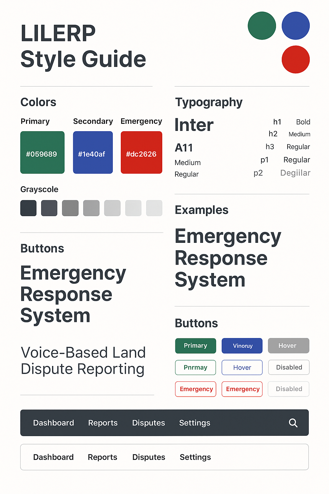

# LILERP Design Documentation

## Overview

This document presents the complete design system for LILERP (Liberia Integrated Land Registry & Emergency Response Platform), including wireframes, style guide, and design specifications for consistent implementation across all platforms.


The wireframe follows a clean, professional layout optimized for emergency response presentation:

**Header Section**

- LILERP logo positioned prominently on the left
- Navigation menu with clear sections: Overview, Features, Demo, Contact
- Clean, minimal design for easy navigation

**Hero Section**

- Bold headline: "Emergency Response for Rural Liberia"
- Clear call-to-action button: "Get Started"
- Hero image placeholder for system demonstration
- Focused messaging on the core problem and solution

**Features Section**

- Three-column grid layout showcasing key components:
  - Voice Interface: IVR system for illiterate users
  - Mobile App: Smartphone emergency reporting
  - Website: Project information and partnership portal
- Each feature includes descriptive text and visual placeholder

**Statistics Section**

- Prominent display of impact metrics: "8,000 land disputes reported"
- Supporting text explaining the scope and importance
- Data-driven credibility for the solution

**Testimonials Section**

- Community feedback and validation
- Builds trust and demonstrates real-world impact
- Placeholder for stakeholder quotes

**Footer Section**

- Standard navigation links: About, Services, Terms, Privacy
- Professional completion of the page structure

### Design Principles Applied

**Accessibility First**

- High contrast elements for visibility
- Clear hierarchy and spacing
- Simple navigation structure
- Mobile-responsive layout considerations

**Emergency Context**

- Professional, trustworthy appearance
- Clear information architecture
- Minimal cognitive load for users
- Focus on essential information

## Style Guide

### Brand Identity



**Color Palette**

*Primary Colors*

- **Primary Green (#059689)**: Represents growth, safety, and positive change
- **Secondary Blue (#1e40af)**: Conveys trust, reliability, and professionalism
- **Emergency Red (#dc2626)**: Used for urgent actions and emergency indicators

*Grayscale Palette*

- Seven-step grayscale from black to light gray
- Ensures proper contrast ratios for accessibility
- Consistent use across all interface elements

**Typography System**

*Font Family: Inter*

- Modern, highly legible sans-serif typeface
- Excellent readability across all device sizes
- Professional appearance suitable for emergency services

*Font Weights and Sizes*

- **h1**: Bold weight for main headlines
- **h2**: Medium weight for section headers
- **h3**: Regular weight for subsection titles
- **p1**: Regular weight for body text
- **p2**: Regular weight for smaller text elements

*Typography Examples*

- "Emergency Response System" - Demonstrates headline styling
- "Voice-Based Land Dispute Reporting" - Shows descriptive text treatment

**Button System**

*Primary Buttons*

- Green background (#059689) for main actions
- High contrast white text
- Rounded corners for modern appearance
- Clear hover and disabled states

*Secondary Buttons*

- Blue background (#1e40af) for secondary actions
- Consistent styling with primary buttons
- Alternative color for visual hierarchy

*Emergency Buttons*

- Red styling (#dc2626) for urgent actions
- Used sparingly for critical functions
- Clear visual distinction from other buttons

**Interface Components**

*Navigation Bars*

- Dark theme option for professional appearance
- Light theme option for accessibility
- Consistent spacing and typography
- Search functionality integration

### Implementation Guidelines

**Color Usage**

- Primary green for main CTAs and positive actions
- Secondary blue for informational elements and secondary actions
- Emergency red only for urgent or critical functions
- Grayscale for text, borders, and neutral elements

**Typography Hierarchy**

- Maintain consistent font sizes across platforms
- Use font weights to establish clear information hierarchy
- Ensure minimum 16px font size for body text
- Test readability across all target devices

**Button Implementation**

- Minimum 44px height for touch accessibility
- Consistent padding and margin spacing
- Clear hover states for desktop interactions
- Disabled states with reduced opacity

**Responsive Considerations**

- Mobile-first design approach
- Scalable typography using relative units
- Flexible grid system for different screen sizes
- Touch-friendly interface elements

## Platform-Specific Applications

### Website Implementation

- Clean, professional layout following wireframe structure
- Full color palette implementation
- Responsive design for desktop, tablet, and mobile
- Focus on project presentation and partnership outreach

### Mobile App Design

- Simplified color scheme for emergency context
- Large, touch-friendly buttons and interface elements
- High contrast for outdoor visibility
- Voice recording interfaces with clear visual feedback

### IVR System Visual Aids

- Voice menu mockups using style guide colors
- Clear visual representations of audio interactions
- Status indicators and progress feedback
- Emergency-focused color coding

## Technical Specifications

### CSS Variables

```css
:root {
  --primary-green: #059689;
  --secondary-blue: #1e40af;
  --emergency-red: #dc2626;
  --text-dark: #1f2937;
  --text-medium: #6b7280;
  --text-light: #9ca3af;
}
```

### Component Classes

```css
.btn-primary {
  background-color: var(--primary-green);
  color: white;
  padding: 12px 24px;
  border-radius: 8px;
}

.btn-secondary {
  background-color: var(--secondary-blue);
  color: white;
  padding: 12px 24px;
  border-radius: 8px;
}

.btn-emergency {
  background-color: var(--emergency-red);
  color: white;
  padding: 12px 24px;
  border-radius: 8px;
}
```

### Typography Classes

```css
.heading-1 {
  font-family: 'Inter', sans-serif;
  font-weight: 700;
  font-size: 2.5rem;
  line-height: 1.2;
}

.heading-2 {
  font-family: 'Inter', sans-serif;
  font-weight: 500;
  font-size: 2rem;
  line-height: 1.3;
}

.body-text {
  font-family: 'Inter', sans-serif;
  font-weight: 400;
  font-size: 1rem;
  line-height: 1.6;
}
```

## Design Checklist

### Visual Consistency

- [x] All colors match the defined palette
- [x] Typography follows the established hierarchy
- [x] Button styles are consistent across platforms
- [x] Spacing follows the grid system
- [x] Icons maintain consistent style and size

### Accessibility Compliance

- [x] Color contrast ratios meet WCAG AA standards
- [x] Text is readable at minimum 16px size
- [x] Interactive elements meet minimum touch target size
- [x] Focus states are clearly visible
- [x] Alternative text provided for all images

### Emergency Context Appropriateness

- [x] Professional, trustworthy appearance
- [x] Clear information hierarchy
- [x] Minimal cognitive load for stressed users
- [x] Cultural sensitivity in design choices
- [x] Appropriate for rural, low-literacy contexts

This comprehensive design system ensures consistent, accessible, and culturally appropriate implementation of LILERP across all platforms while maintaining the professional standards required for emergency response services.
